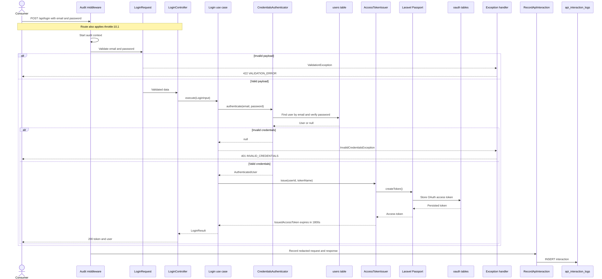
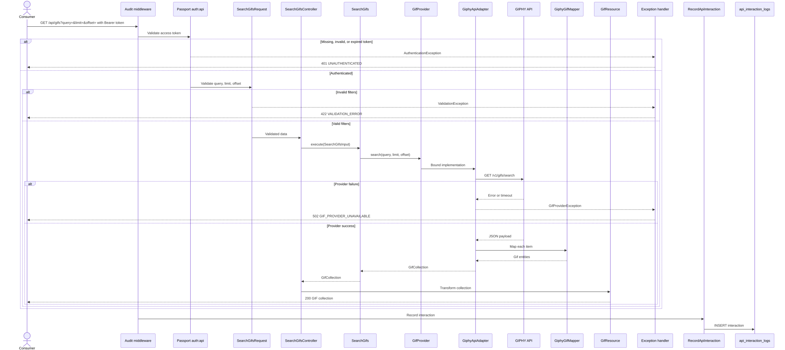
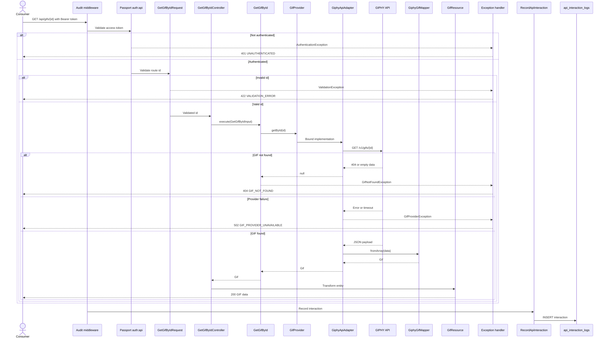
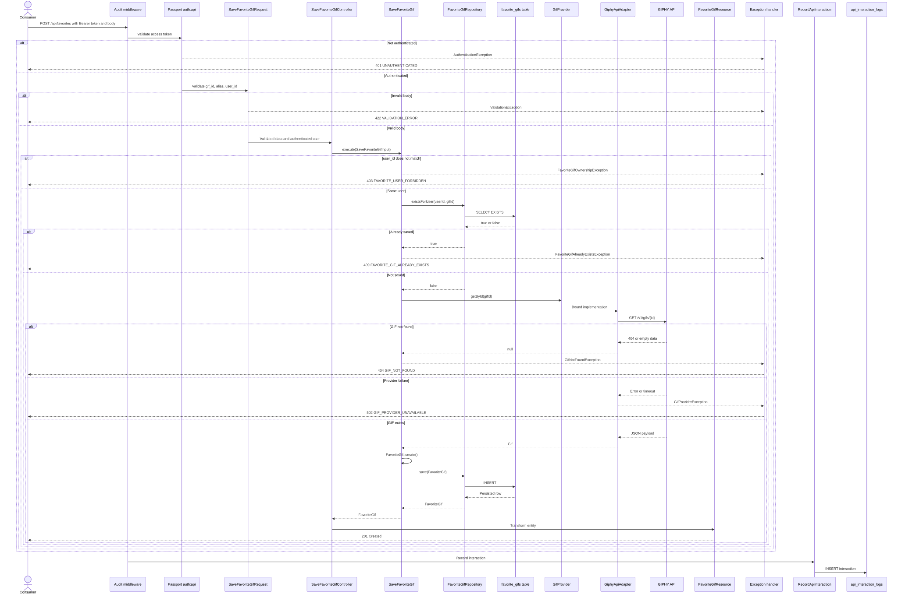

# Prex Giphy API

API REST desarrollada para el challenge PHP Hexagonal. Permite autenticar usuarios mediante OAuth 2.0, buscar GIFs en GIPHY, consultar un GIF por ID y guardar GIFs favoritos.

## Tecnologías

- PHP 8.3
- Laravel 13
- Laravel Passport / OAuth 2.0
- MySQL 8.4
- Nginx
- Docker y Docker Compose
- PHPUnit
- Larastan / PHPStan
- Laravel Pint
- Mermaid
- Postman

## Funcionalidades

- Login mediante email y contraseña.
- Access tokens OAuth 2.0 con una duración de 30 minutos.
- Búsqueda de GIFs por término.
- Consulta de un GIF por ID.
- Persistencia de GIFs favoritos.
- Auditoría de todas las interacciones de la API.
- Redacción de contraseñas y tokens en los registros de auditoría.
- Validación uniforme y respuestas JSON.
- Tests unitarios, Feature y de arquitectura.

## Arquitectura

La aplicación utiliza arquitectura hexagonal y principios de Domain-Driven Design.

```text
Infrastructure → Application → Domain
```

### Domain

Contiene entidades, objetos de valor, excepciones y puertos. No depende de Laravel, Eloquent, Passport, MySQL ni GIPHY.

### Application

Contiene los casos de uso y sus objetos de entrada y salida. Depende del dominio, pero no de adaptadores concretos.

### Infrastructure

Contiene controladores HTTP, Form Requests, JSON Resources, middleware, persistencia Eloquent, Passport y el adaptador de GIPHY.

### Estructura principal

```text
app/
├── Domain/
│   ├── Audit/
│   ├── Auth/
│   ├── Favorite/
│   └── Gif/
├── Application/
│   ├── Audit/
│   ├── Auth/
│   ├── Favorite/
│   └── Gif/
└── Infrastructure/
    ├── Audit/
    ├── Auth/
    ├── Favorite/
    ├── Gif/
    ├── Http/
    └── Providers/
```

## Flujo de dependencias

Los casos de uso dependen de contratos:

```text
SearchGifs → GifProvider
GetGifById → GifProvider
SaveFavoriteGif → FavoriteGifRepository + GifProvider
Login → CredentialsAuthenticator + AccessTokenIssuer
RecordApiInteraction → ApiInteractionRepository
```

Infraestructura implementa esos contratos:

```text
GifProvider → GiphyApiAdapter
FavoriteGifRepository → EloquentFavoriteGifRepository
CredentialsAuthenticator → EloquentCredentialsAuthenticator
AccessTokenIssuer → PassportAccessTokenIssuer
ApiInteractionRepository → EloquentApiInteractionRepository
```

## Requisitos

- Docker Engine.
- Docker Compose.
- Git.
- Una API key válida de GIPHY.

No es necesario instalar PHP, Composer, Nginx ni MySQL directamente en el equipo anfitrión.

## Instalación local

### 1. Clonar el repositorio

```bash
git clone https://github.com/GonzaloMayorga/prex-giphy-api--Challenge
cd prex-giphy-api--Challenge
```

### 2. Crear el archivo de entorno

```bash
cp .env.example .env
```

Obtener el UID y GID del usuario local:

```bash
id -u
id -g
```

Configurar como mínimo:

```dotenv
LOCAL_UID=1000
LOCAL_GID=1000

GIPHY_API_KEY=debe reemplazarse por una key real antes de probar los endpoints.

DEMO_USER_NAME="Challenge User"
DEMO_USER_EMAIL=challenge@example.com
DEMO_USER_PASSWORD=debe reemplazarse por un valor real antes de ejecutar db:seed.
```

Los valores `LOCAL_UID` y `LOCAL_GID` deben reemplazarse por el resultado real de `id -u` e `id -g`.

### 3. Construir los contenedores

```bash
docker compose build
```

### 4. Levantar la aplicación

```bash
docker compose up -d
```

Verificar el estado:

```bash
docker compose ps
```

### 5. Instalar dependencias PHP

```bash
docker compose exec app composer install
```

### 6. Generar la clave de Laravel

```bash
docker compose exec app php artisan key:generate
```

### 7. Ejecutar migraciones

```bash
docker compose exec app php artisan migrate
```

### 8. Configurar Laravel Passport

Generar las claves OAuth:

```bash
docker compose exec app php artisan passport:keys
```

Crear el cliente de acceso personal:

```bash
docker compose exec app php artisan passport:client \
  --personal \
  --provider=users \
  --name="Prex Giphy API Personal Access Client"
```

Este cliente debe crearse una sola vez por base de datos.

### 9. Crear el usuario de demostración

```bash
docker compose exec app php artisan db:seed
```

### 10. Limpiar cachés de desarrollo

```bash
docker compose exec app php artisan optimize:clear
```

La API estará disponible en:

```text
http://localhost:8080
```

La comprobación de salud estará disponible en:

```text
http://localhost:8080/up
```

## Endpoints

| Método | Endpoint | Autenticación | Descripción |
|---|---|---:|---|
| POST | `/api/login` | No | Iniciar sesión y obtener un token |
| GET | `/api/gifs` | Bearer | Buscar GIFs |
| GET | `/api/gifs/{id}` | Bearer | Buscar un GIF por ID |
| POST | `/api/favorites` | Bearer | Guardar un GIF favorito |

## Autenticación

### Login

```http
POST /api/login
Accept: application/json
Content-Type: application/json
```

```json
{
    "email": "challenge@example.com",
    "password": "your-password"
}
```

Respuesta exitosa:

```json
{
    "data": {
        "access_token": "...",
        "token_type": "Bearer",
        "expires_in": 1800,
        "expires_at": "2026-07-28T00:00:00+00:00",
        "user": {
            "id": 1,
            "name": "Challenge User",
            "email": "challenge@example.com"
        }
    }
}
```

El token debe enviarse en los endpoints protegidos:

```http
Authorization: Bearer <access_token>
```

## Buscar GIFs

```http
GET /api/gifs?query=metalcore&limit=10&offset=0
Authorization: Bearer <access_token>
Accept: application/json
```

Parámetros:

- `query`: obligatorio, string y máximo 50 caracteres.
- `limit`: opcional, entero entre 1 y 50. Valor predeterminado: 10.
- `offset`: opcional, entero entre 0 y 4999. Valor predeterminado: 0.

## Buscar un GIF por ID

```http
GET /api/gifs/{id}
Authorization: Bearer <access_token>
Accept: application/json
```

Aunque la consigna describe el ID como numérico, se modela como string porque los identificadores reales de GIPHY son alfanuméricos.

## Guardar un favorito

```http
POST /api/favorites
Authorization: Bearer <access_token>
Accept: application/json
Content-Type: application/json
```

```json
{
    "gif_id": "abc123",
    "alias": "Mi favorito",
    "user_id": 1
}
```

Reglas:

- `gif_id` debe corresponder a un GIF existente en GIPHY.
- `alias` es obligatorio y admite hasta 100 caracteres.
- `user_id` debe coincidir con el usuario autenticado.
- Un mismo usuario no puede guardar dos veces el mismo GIF.

## Códigos HTTP

| Código | Significado |
|---:|---|
| 200 | Operación exitosa |
| 201 | Favorito creado |
| 401 | No autenticado o credenciales inválidas |
| 403 | Intento de guardar un favorito para otro usuario |
| 404 | GIF o ruta inexistente |
| 405 | Método HTTP no permitido |
| 409 | El GIF ya está guardado como favorito |
| 422 | Error de validación |
| 500 | Error al persistir el favorito |
| 502 | GIPHY no está disponible o devolvió una respuesta inválida |

## Auditoría

Todas las interacciones con los endpoints API registran:

- Usuario.
- Servicio.
- Método HTTP.
- Ruta.
- Query string.
- Body de la petición.
- Parámetros de ruta.
- Estado HTTP.
- Cuerpo de la respuesta.
- IP de origen.
- Duración.
- Fecha de creación.

Los datos sensibles se reemplazan por:

```text
[REDACTED]
```

Esto incluye contraseñas, access tokens, refresh tokens, secretos OAuth, tokens genéricos y valores de autorización.

La auditoría puede configurarse mediante:

```dotenv
AUDIT_ENABLED=true
AUDIT_MAX_PAYLOAD_BYTES=1048576
```

## Tests

Ejecutar toda la suite:

```bash
docker compose exec app php artisan test
```

O mediante Make:

```bash
make test
```

La suite contiene:

- Tests unitarios de Domain y Application.
- Tests del mapper de GIPHY.
- Tests del adaptador HTTP de GIPHY usando respuestas simuladas.
- Tests de repositorios Eloquent.
- Tests Feature de los endpoints.
- Tests de autenticación Passport.
- Tests del middleware de auditoría.
- Tests de reglas arquitectónicas.

## Calidad de código

Aplicar formato:

```bash
make format
```

Comprobar formato:

```bash
make lint
```

Ejecutar análisis estático:

```bash
make analyse
```

Auditar dependencias:

```bash
make audit
```

Ejecutar todas las verificaciones:

```bash
make quality
```

Equivalente con Composer:

```bash
docker compose exec app composer quality
```

## Postman

La entrega incluye:

```text
postman/Prex-Giphy-API.postman_collection.json
postman/Prex-Giphy-API-Local.postman_environment.json
```

Después de importarlos:

1. Seleccionar el entorno `Prex Giphy API - Local`.
2. Completar localmente la variable `password`.
3. Ejecutar `Login`.
4. Ejecutar `Search GIFs`.
5. Ejecutar `Find GIF by ID`.
6. Ejecutar `Save Favorite GIF`.

La petición de login almacena automáticamente:

- `access_token`
- `expires_at`
- `user_id`

La búsqueda almacena automáticamente el primer `gif_id` obtenido.

Los scripts guardan las variables en el entorno activo y también en las variables
de la colección. En Postman, los valores generados por los scripts se ven como
`Current value`; el archivo exportado no incluye esos valores runtime. Si no se
selecciona el entorno local, completar `password` en las variables de la
colección antes de ejecutar `Login`.

Cada request protegida inyecta el header `Authorization` antes de enviarse. Si
`access_token` todavía no está disponible, Postman ejecuta un auto-login usando
`email` y `password`, guarda las variables obtenidas y continúa con la petición.
Esto evita depender del refresco visual de la tabla de variables de Postman.

## Diagramas

### Casos de uso



### Arquitectura



### Secuencia de login



### Secuencia de búsqueda



### Secuencia de búsqueda por ID



### Secuencia de guardado de favorito



### Modelo de datos



Los archivos fuente Mermaid se encuentran en:

```text
docs/diagrams/mermaid/
```

Para regenerar los SVG:

```bash
make diagrams
```

El comando usa Mermaid CLI mediante Docker, por lo que no requiere instalar Node ni Mermaid en el equipo anfitrión.

## Decisiones técnicas

- Se utilizó Laravel 13 porque la consigna admite Laravel 11 o superior y Laravel 11 ya no tenía soporte de seguridad.
- Passport fue elegido porque la consigna requiere OAuth 2.0.
- El login propio valida email y contraseña y emite un personal access token de Passport.
- El token expira a los 30 minutos.
- El ID de GIPHY se representa como string porque sus IDs reales son alfanuméricos.
- El usuario autenticado debe coincidir con el `user_id` solicitado.
- Los favoritos duplicados responden `409 Conflict`.
- Las fallas del proveedor externo responden `502 Bad Gateway`.
- Los cuerpos auditados tienen un límite de tamaño.
- Las contraseñas y tokens nunca se almacenan sin redactar.
- Las claves de Passport, `.env` y la API key de GIPHY no se versionan.
- Los controladores no realizan persistencia directa.
- Las capas Domain y Application no dependen de Laravel ni de Infrastructure.

## Despliegue

Las instrucciones de despliegue se encuentran en:

```text
docs/DEPLOYMENT.md
```
